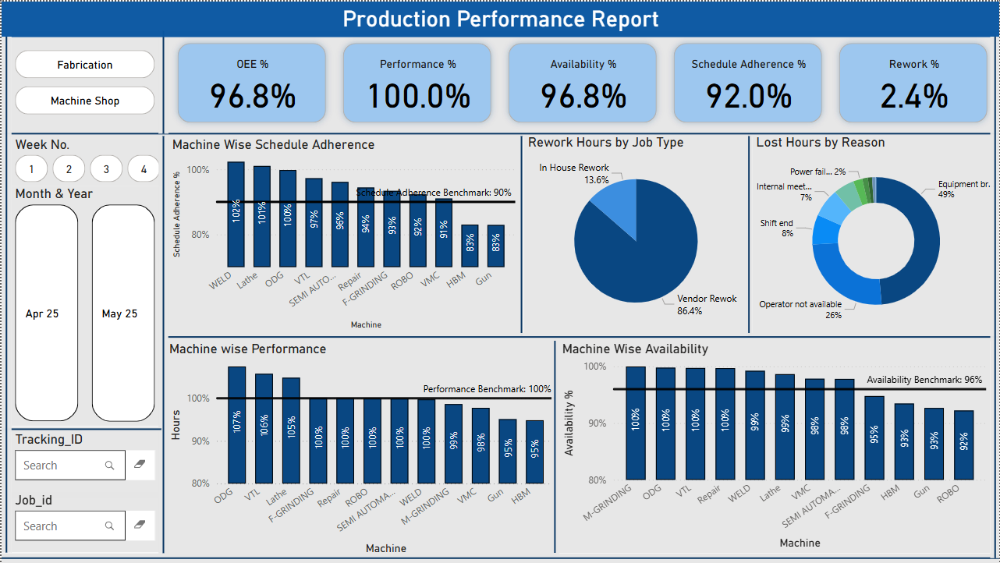

Production Performance Dashboard – Power BI Automation

📊 Overview

This project showcases a fully automated Power BI dashboard built for tracking weekly production KPIs in a manufacturing machine shop. The dashboard consumes job and runtime data from the MES (Manufacturing Execution System), significantly reducing manual effort and human error in KPI reporting.

Designed to assist shift engineers and managers, this solution enables fast, data-driven decisions by visualizing key metrics like OEE, Availability, Performance, Rework %, and Schedule Adherence.

Link to Dashboard: https://ssninstitute-my.sharepoint.com/:u:/g/personal/nithis2110381_ssn_edu_in/EWDPHMSAN8ZDqISRZsdCAl8BunngDujEmNtmIDZuTDGJWw?e=1rQJOA

---

Problem Statement

Previously, weekly KPI reports were generated manually using Excel. This was:

- Time-consuming (1–2 hours per week)
- Prone to inconsistencies and manual errors
- Delayed visibility into operational issues

---

Solution

By structuring Excel files to align with MES exports, and connecting them to Power BI with calculated metrics and benchmarks, this solution automates report generation. Now, pasting data into the Excel template updates the full dashboard instantly—no manual calculations needed.

---

Features

-  **KPI Metrics**: OEE %, Availability %, Performance %, Schedule Adherence %, Rework %
-  **Machine-wise Drilldowns**:
  - Performance vs benchmark
  - Availability trends
  - Schedule adherence
-  **Pie Charts** for:
  - Lost hours breakdown by reason (e.g., breakdown, shift end, no operator)
  - Rework analysis (vendor vs in-house)
-  **Benchmarks Comparison** for every KPI
-  **Plug-and-play Excel backend** for quick updates by any team member

---

Tools & Tech Used

- **Power BI** – for data modeling and visualization
- **Microsoft Excel** – data source with pre-defined format
- **MES System** – manual data pull from company server
- **DAX** – calculated columns for performance, availability, and custom benchmarks

---

Folder Structure

